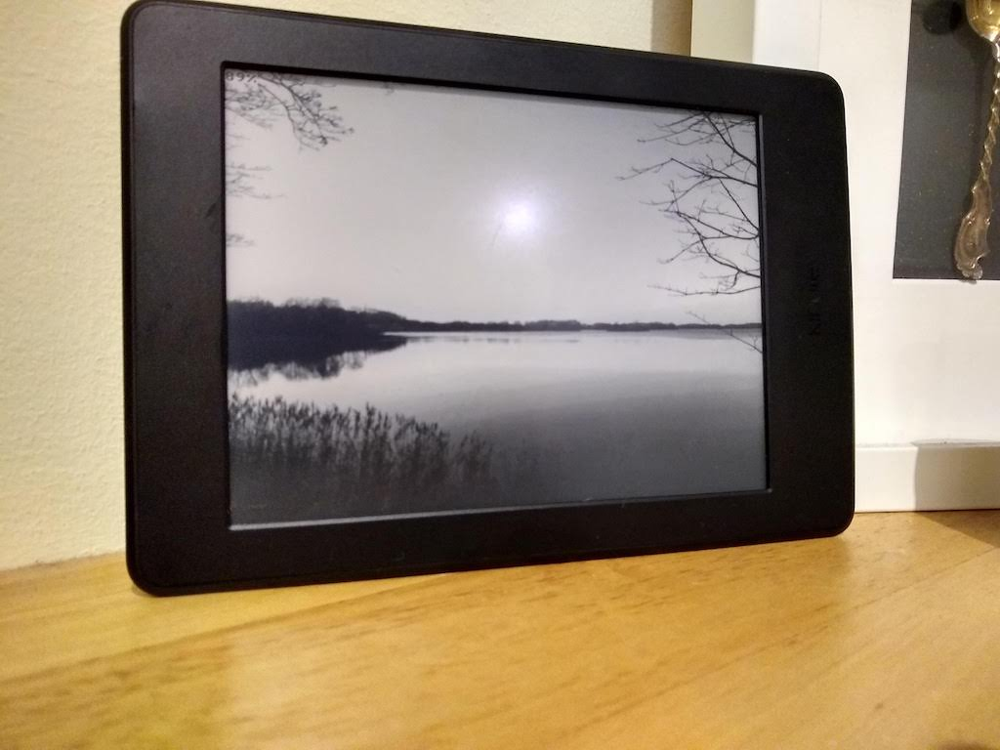

# Kindle Google Photos Picture Frame
The idea is to turn a Kindle Paperwhite into an eInk digital picture frame displaying photos from a shared Google Photos folder.

Every 24h a new photo will be displayed. In the top left the battery percentage is displayed.

## What's What

* `get_gphoto.py`: Downloads a random image from a shared album called `kindle`
* `kindle-gphotos.sh`: Main loop on kindle, handles kindle stuff, wifi, calls `get_gphoto.py`, suspend to RAM etc.
* `wifi.sh`: Wifi helper script
* `sync2kindle.sh`: Simple rsync helper for development

## Kindle preparation:
* Get a Kindle Paperwhite 2 or 3 (other models may also work with modifications to this code)
* jailbreak the kindle (doh!)  --> [Mobileread Forum Thread](https://www.mobileread.com/forums/showthread.php?t=320564)
* Install KUAL and MRPI (MRPI includes fbink)
* Add USBnetworking and python (via MRPI)

## Setup
* Google Photos: Create a shared album called `kindle` in Google Photos and add a couple of photos. I typically use black and white filtered copies of photos. The "Vista" Filter in Google Photos works fine for me for enhancing contrast. Also, I use the "Light" fader to slightly overexpose the photos. This makes them more suitable for using a 4-bit eInk display. Just using the original color images looked too dull on the eink display.

* Google API Client ID: You will need an [OAuth2](https://developers.google.com/identity/protocols/OAuth2) Client ID from Google in order to use the Photos API. Obtain OAuth 2.0 client credentials from the [Developers Console](https://console.developers.google.com/). Make sure to enable the Photos Library API and then select `.../auth/photoslibrary.readonly` from the scope list. Using a non-verified application (i.e. not letting the consent screen being verified from Google) is totally possible, you will just get a warning of an unverified app the first time you call the `get_photo.py` script, see below.

* Rename your OAuth credential file to `client_secret.json` and put it next to `get_gphoto.py`. Call `get_gphoto.py` to debug. On the very first call you will be asked to visit the Google Consent Screen and paste a confirmation code back to the terminal. This should result in a downloaded `photo.jpg`.

* Edit `wifi.sh`, add SSID and PW for your wifi.

* Edit `FBROTATE`and  `BACKLIGHT` in `kindle-gphotos.sh` according to your hardware.

## Credits
I am using code, especially for authorization and the REST api, from https://github.com/gilesknap/gphotos-sync
